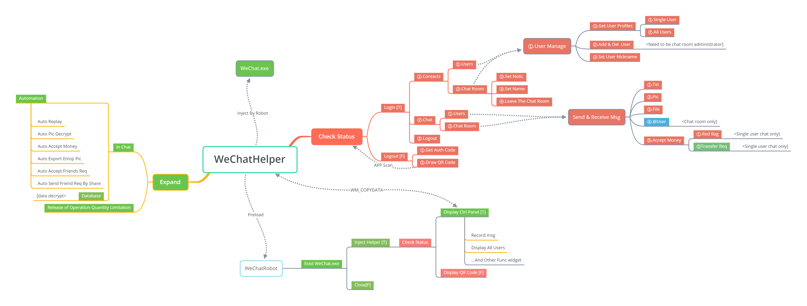

## Last Update Note:

### 2019-7-29

### Fix Bug:
1. When in the QR code login panel, the operating system resource overhead is severe, causing the program to crash.

## All Featrues:

``Default Emoji Pic Folder: %temp%\WeChatExpressions\``

## Todo List:
▢Data bridge         Processing
▢Websocket API       Processing
▢HTTP REST API       Undetermined

## List Of References:
> PCXX逆向：使用CE+OD查找个人数据：https://blog.csdn.net/qq_38474570/article/details/92571302

> PCXX逆向：使用HOOK拦截二维码：https://blog.csdn.net/qq_38474570/article/details/92798577

> PCXX逆向：发送与接收消息的分析与代码实现：https://blog.csdn.net/qq_38474570/article/details/93339861

> PCXX逆向：使用HOOK获取好友列表和群列表：https://blog.csdn.net/qq_38474570/article/details/95889507

> PC微信逆向：两种姿势教你解密数据库文件：https://blog.csdn.net/qq_38474570/article/details/96606530

### The Source Last Push By:

``Author : Cato [fix@nil.run]``
